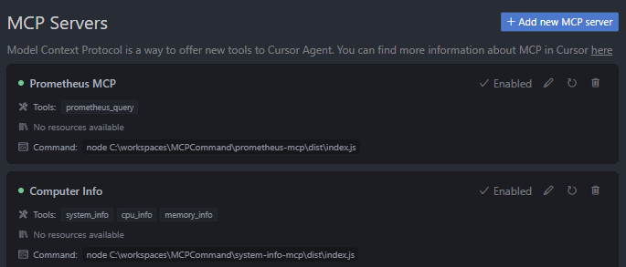
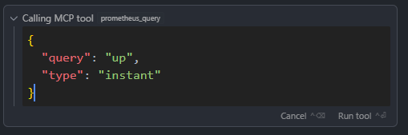
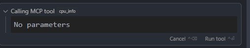

# cursor-mcp-tools
develop cursor mcp tools with node + typescripts

# typescript 项目初始化必备 文件
```
./src/index.ts
package.json // 包含了默认mcp依赖包
tsconfig.json
```

# 核心逻辑实现在 index.js, 怎么唤醒cursor使用mcp 
```
server.tool(
  "system_info",
  "获取系统信息",
  {},
```

```
    server.tool(
      "prometheus_query",
      "Execute PromQL queries against Prometheus",
```

# 项目结构
```
# tree /f

│  .gitignore
│  LICENSE
│  README.md
│
├─prometheus-mcp
│  │  .env
│  │  package-lock.json
│  │  package.json
│  │  pnpm-lock.yaml
│  │  tsconfig.json
│  │
│  └─src
│          config.ts
│          index.ts
│          prometheus.ts
│          types.ts
│
└─system-info-mcp
    │  package.json
    │  pnpm-lock.yaml
    │  tsconfig.json
    │
    └─src
            index.ts
```
# 进入目录安装依赖包， build， 加入mcp server
在 Cursor 中重新配置 MCP 服务器，使用以下步骤：
点击 "Add new MCP server"
名字：自定义
选择命令（command）
在命令行中输入：node /xxx/xx.xx/dist/index.js
json方式添加
```
// This example demonstrated an MCP server using the stdio format
// Cursor automatically runs this process for you
// This uses a Node.js server, ran with `npx`
{
  "mcpServers": {
    "server-name": {
      "command": "npx",
      "args": ["-y", "mcp-server"],
      "env": {
        "API_KEY": "value"
      }
    }
  }
}

// This example demonstrated an MCP server using the stdio format
// Cursor automatically runs this process for you
// This uses a Python server, ran with `python`
{
  "mcpServers": {
    "server-name": {
      "command": "python",
      "args": ["mcp-server.py"],
      "env": {
        "API_KEY": "value"
      }
    }
  }
}

// This example demonstrated an MCP server using the SSE format
// The user should manually setup and run the server
// This could be networked, to allow others to access it too
{
  "mcpServers": {
    "server-name": {
      "url": "http://localhost:3000/sse",
      "env": {
        "API_KEY": "value"
      }
    }
  }
}

```

# 启动mcp





